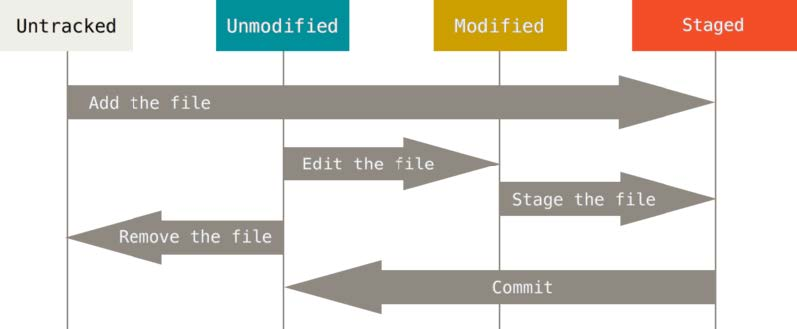

**Getting a Git Repository**

You typically obtain a Git repository in one of two ways:

1. You can take a local directory that is currently not under version control, and turn it into a Git
repository, or
2. You can clone an existing Git repository from elsewhere.

In either case, you end up with a Git repository on your local machine, ready for work.
Initializing a Repository in an Existing Directory

If you have a project directory that is currently not under version control and you want to start
controlling it with Git, you first need to go to that project’s directory. If you’ve never done this, it
looks a little different depending on which system you’re running:

:for Linux:
``$ cd /home/user/my_project``

:for Mac:
``$ cd /Users/user/my_project``

:for Windows:
``$ cd /c/user/my_project``

and type:
``$ git init``

This creates a new subdirectory named .git that contains all of your necessary repository files — a
Git repository skeleton. At this point, nothing in your project is tracked yet.

If you want to start version-controlling existing files (as opposed to an empty directory), you should
probably begin tracking those files and do an initial commit. 

You can accomplish that with a few
git add commands that specify the files you want to track, followed by a git commit:

``$ git add *.c``

``$ git add README``

``$ git commit -m "Add README file initial version control"``

**Recording Changes to the Repository**

At this point, you should have a bona fide Git repository on your local machine, and a checkout or
working copy of all of its files in front of you. 

Remember that each file in your working directory can be in one of two states: tracked or
untracked. Tracked files are files that were in the last snapshot; they can be unmodified, modified,
or staged. 

Untracked files are everything else — any files in your working directory that were not in your last
snapshot and are not in your staging area. When you first clone a repository, all of your files will be
tracked and unmodified because Git just checked them out and you haven’t edited anything.
As you edit files, Git sees them as modified, because you’ve changed them since your last commit.
As you work, you selectively stage these modified files and then commit all those staged changes,
and the cycle repeats.

